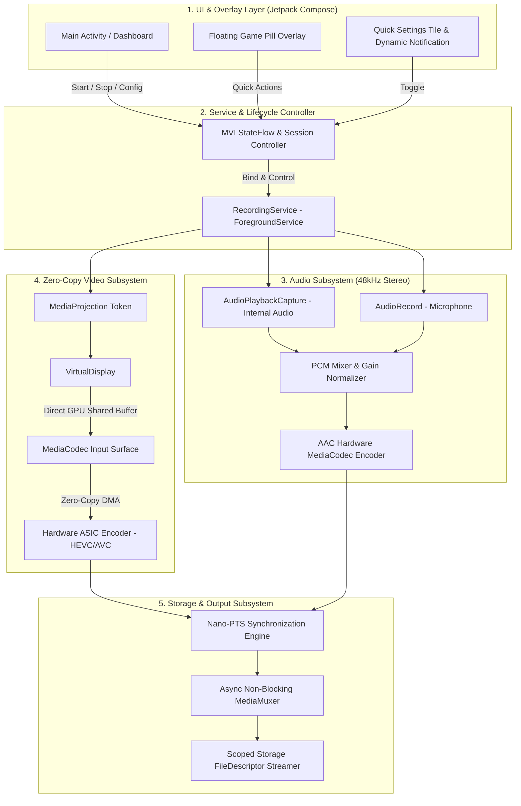

# REC: Technical Specification & Engineering Blueprint

> **A High-Performance, Zero-Copy, Zero-Bloat Screen Recording Engine for Android (by PixL).**

---

## 1. Executive Summary & Core Objectives

**REC** is a native Android screen recording application engineered for high-refresh-rate mobile gaming, content creation, and frame-accurate UI diagnostics.

The system's core architecture eliminates CPU-heavy pixel copying by piping Android's display compositor directly into dedicated hardware video encoders via shared GPU buffers (`MediaProjection` $\rightarrow$ `VirtualDisplay` $\rightarrow$ `MediaCodec` Input Surface).

### Key Technical Goals
* **True Native Resolution:** 1080p, 1440p QHD+, and 4K (matched to display bounds).
* **High-Refresh-Rate Encoding:** 60 FPS, 90 FPS, and 120 FPS (with dynamic 144 FPS capability probing).
* **Minimal System Overhead:** Realistically **~3–5% total CPU utilization** during sustained 1080p 120 FPS capture (0% video encoding CPU overhead + ~1% audio mixing + ~1% disk I/O + ~1–2% Compose overlay).
* **Studio-Grade Codecs:** Hardware **HEVC (H.265)** as primary, **AVC (H.264)** as universal fallback, and **AV1** as a dynamically probed option on supported flagship SoCs.
* **Lossless Internal Audio & Mic Mixing:** Android 10+ `AudioPlaybackCapture` with nanosecond-precision Presentation Timestamps (`PTS`) for zero audio drift.
* **Modern & Non-Intrusive UI:** Jetpack Compose Material 3 dark theme with an interactive floating game pill that auto-collapses into a micro-dot during gameplay.
* **Privacy-First & Clean:** Fully offline, no account requirements, no cloud bloat, no telemetry, and zero ads.

---

## 2. Platform & Compatibility Targets

| Target | Specification | Rationale |
| :--- | :--- | :--- |
| **Minimum SDK** | `API 29` (Android 10) | Required for native internal audio capture (`AudioPlaybackCaptureConfiguration`). |
| **Target SDK** | `API 35` (Android 15) | Compliance with the latest Android 14/15 foreground service types and security policies. |
| **Language & Tooling** | Kotlin 2.0+ / Android Gradle Plugin 8.5+ | Modern coroutines, Flow API, and Jetpack Compose compiler. |
| **UI Framework** | Jetpack Compose + Material 3 | Direct hardware-accelerated rendering on Vulkan/Skia canvas. |

---

## 3. Hardware Codec & Capability Matrix

To prevent encoder crashes (`IllegalArgumentException` or `CodecException`), the engine performs a **pre-flight capability probe** via `MediaCodecList` before configuring any recording session:

```
┌─────────────────────────────────────────────────────────────┐
│                    Codec Pre-Flight Scanner                 │
│                                                             │
│  1. Probe Hardware Encoders only (isHardwareAccelerated)    │
│     ├── video/hevc (Primary - HEVC Main Profile)            │
│     ├── video/avc  (Fallback - AVC High Profile)            │
│     └── video/av01 (Probed: Only if hardware ASIC exists)   │
│                                                             │
│  2. Probe Resolution & Framerate Boundaries                 │
│     ├── Max Width / Height (e.g. 3840x2160)                 │
│     ├── Max Supported Framerate (60 / 90 / 120 / 144 FPS)   │
│     └── Macroblock Processing Rate (Blocks/Second)          │
└─────────────────────────────────────────────────────────────┘
```

### Codec Support Strategy
1. **Primary: HEVC (H.265)**
   * Provides 40–50% better compression efficiency than H.264 at identical bitrates.
   * Essential for 120 FPS recording to avoid saturating storage I/O.
2. **Fallback: AVC (H.264)**
   * Used on legacy or budget SoCs lacking robust HEVC encoder tiers.
3. **Flagship / Probed: AV1 (`video/av01`)**
   * **Strict Constraint:** Must only be selected if `MediaCodecInfo.isHardwareAccelerated` returns `true`. If only software AV1 (`c2.android.av1.encoder` / `libaom`) is present, AV1 is disabled to prevent severe CPU thrashing.
4. **Framerate Clamping:**
   * 60 FPS, 90 FPS, and 120 FPS are standard options.
   * 144 FPS is dynamically unlocked **only** if the queried `VideoCapabilities.supportedFrameRates` on the hardware encoder explicitly permits $\ge 144$ FPS at the selected resolution.

---

## 4. System Architecture & Zero-Copy Pipeline



---

## 5. Subsystem Specifications

### 5.1. Zero-Copy Video Engine (`core:engine`)
* **Pipeline Mechanism:**
  1. `MediaCodec.createEncoderByType("video/hevc")` initializes the hardware video encoder.
  2. `encoder.createInputSurface()` generates an input `Surface` backed directly by `AHardwareBuffer` / `GraphicBuffer`.
  3. `mediaProjection.createVirtualDisplay(...)` binds the display directly to this Surface.
  4. Android's `SurfaceFlinger` and Hardware Composer (HWC) render display layers directly to shared GPU/VPU memory with zero CPU pixel copies.
* **Encoder Performance Optimization:**
  * `MediaFormat.setInteger(MediaFormat.KEY_OPERATING_RATE, targetFps)` to raise the encoder hardware clock frequency.
  * `MediaFormat.setInteger(MediaFormat.KEY_PRIORITY, 0)` for real-time kernel scheduling.
  * Configurable Bitrate: 10 Mbps to 100 Mbps (`BITRATE_MODE_VBR` or `BITRATE_MODE_CQ`).

### 5.2. Audio Capture & Policy Handling (`core:audio`)
* **Internal Audio Capture:** Handled via `AudioPlaybackCaptureConfiguration` (API 29+).
* **OS Policy & DRM Limitations:**
  * If third-party applications (e.g. Netflix, Spotify, banking apps) set `AudioAttributes.FLAG_CONTENT_SECURE` or `setAllowedCapturePolicy(ALLOW_CAPTURE_BY_NONE)`, the OS silences their audio stream.
  * The engine gracefully handles silent audio frames without crashing or corrupting the AAC encoder track.
* **Microphone & Mixing:** `AudioRecord` (16-bit PCM, 48kHz stereo) with real-time gain multipliers and audio clipping protection.
* **A/V Synchronization:** Audio buffers receive presentation timestamps directly synchronized with the system monotonic clock (`System.nanoTime()`), aligning 1:1 with video `PTS`.

### 5.3. Android 14/15 Lifecycle & Permissions (`service/`)
* **Foreground Service Enforcement:** Declares `FOREGROUND_SERVICE_TYPE_MEDIA_PROJECTION` in `AndroidManifest.xml`.
* **Single-Use Consent Tokens:** On Android 14+ (API 34+), `MediaProjection` consent tokens are single-use and expire if not bound to an active foreground service immediately.
* **Resilience:** Cleanly handles display rotation, resolution switches, and incoming phone calls without dropping codec buffers.

### 5.4. Storage Estimation & Scoped Storage (`core:storage`)
* **Scoped Storage:** Directly streams to `MediaStore.Video.Media` with `IS_PENDING = 1` during recording, toggling to `0` upon completion for instant gallery availability.
* **Storage Warning System:**
  * Computes estimated storage consumption in real time:
    $$\text{Data Rate (MB/min)} = \frac{\text{Video Bitrate (Mbps)} + \text{Audio Bitrate (Mbps)}}{8} \times 60$$
  * Example: 1080p @ 120 FPS at 50 Mbps $\approx 375\text{ MB/min}$ ($22.5\text{ GB/hour}$).
  * Warns the user if free disk space is $< 2\text{ GB}$ or insufficient for estimated duration.

---

## 6. UI/UX Design System (Jetpack Compose)

### 6.1. Aesthetic & Visual Language
* **Theme:** Obsidian Cyberpunk & Frosted Glassmorphism.
* **Colors:**
  * Background: Deep Obsidian (`#08080C`)
  * Cards / Surfaces: Frosted Charcoal (`#12121A`) with 10% translucent white border
  * Accent Primary: Neon Cyan (`#00F0FF`)
  * Accent Secondary: Electric Purple (`#8A2BE2`)
  * Recording Active: Pulsing Crimson (`#FF334B`)

### 6.2. Key Components
1. **Live Telemetry Dashboard:**
   * Active display refresh rate badge (e.g. `120 Hz Native`).
   * Real-time encoding bitrate and estimated file size indicator.
   * Twin-channel live audio VU meter (Game audio vs Microphone audio levels).
2. **Smart Floating Game Pill:**
   * **Expanded Mode:** Record, Pause/Resume, Stop, Mic Mute, Facecam, Annotation Pen.
   * **Collapsed Mode:** Shrinks into a 6dp glowing pixel dot that hugs the screen edge at 20% opacity so it never blocks crosshairs or game controls.
   * **Physics:** Spring-based dragging and edge-snapping with crisp haptic feedback.

---

## 7. Package & Module Structure

```
PixL-Recorder/
├── PROJECT_BLUEPRINT.md               # Technical Specification & PRD
├── build.gradle.kts                   # Root Gradle build script
├── settings.gradle.kts                # Project module definitions
├── app/
│   ├── build.gradle.kts
│   └── src/main/
│       ├── AndroidManifest.xml        # MediaProjection FGS, permissions, QS Tiles
│       ├── java/dev/pixl/recorder/
│       │   ├── PixLApp.kt             # Application entry point
│       │   ├── core/
│       │   │   ├── engine/            # Zero-copy MediaCodec & VirtualDisplay pipeline
│       │   │   │   ├── VideoEncoder.kt
│       │   │   │   ├── AudioEncoder.kt
│       │   │   │   ├── ScreenRecorderEngine.kt
│       │   │   │   └── CodecProbe.kt  # Hardware capabilities scanner
│       │   │   ├── audio/             # AudioPlaybackCapture + Mic mixer
│       │   │   │   ├── AudioCaptureManager.kt
│       │   │   │   └── PcmAudioMixer.kt
│       │   │   ├── storage/           # MediaStore writer & storage calculator
│       │   │   │   ├── MediaStoreWriter.kt
│       │   │   │   └── StorageCalculator.kt
│       │   │   └── model/             # Config, State, Resolutions, FPS
│       │   │       ├── RecordingConfig.kt
│       │   │       └── RecorderState.kt
│       │   ├── service/
│       │   │   ├── RecordingService.kt       # MediaProjection Foreground Service
│       │   │   └── FloatingOverlayService.kt # Draggable Compose Overlay Pill
│       │   └── ui/
│       │       ├── theme/             # Cyberpunk Theme & Glassmorphism
│       │       │   ├── Color.kt
│       │       │   ├── Theme.kt
│       │       │   └── Type.kt
│       │       ├── dashboard/         # Main Screen with telemetry & settings
│       │       │   ├── DashboardScreen.kt
│       │       │   └── DashboardViewModel.kt
│       │       ├── overlay/           # Compose floating bubble UI
│       │       │   └── FloatingPillView.kt
│       │       └── components/        # Audio Visualizer, GlassCard, NeonButton
│       │           ├── AudioVisualizer.kt
│       │           ├── NeonButton.kt
│       │           └── TelemetryCard.kt
│       └── res/                       # Vectors, Drawables, Strings, Icons
```

---

## 8. Comprehensive Testing & Verification Plan

```
┌─────────────────────────────────────────────────────────────┐
│                 4-Phase Verification Pipeline               │
│                                                             │
│  Phase 1: Unit & Capability Probing                         │
│  ├── Codec capability bounds & level limits                 │
│  └── PTS monotonic timestamp math verification              │
│                                                             │
│  Phase 2: A/V Sync & Stress Testing                         │
│  ├── 60-minute continuous Flash-Beep sync test (<10ms drift)│
│  └── Mid-recording orientation change & display resize      │
│                                                             │
│  Phase 3: Real-Time Performance Benchmarking                │
│  ├── CPU overhead verification (< 5% total CPU)             │
│  ├── Zero in-game dropped frames (SurfaceFlinger latency)   │
│  └── Perfetto trace analysis (No VSYNC misses)              │
│                                                             │
│  Phase 4: UI & Lifecycle Validation                         │
│  ├── Compose UI & floating pill edge-snapping               │
│  └── Android 14/15 single-use token lifecycle & recovery    │
└─────────────────────────────────────────────────────────────┘
```

### Benchmark Targets

| Metric | Target Goal | Testing Method |
| :--- | :--- | :--- |
| **Total CPU Overhead** | **$< 5.0\%$ total** (Video VPU: 0%, Audio: ~1%, Disk: ~1%, UI: ~1–2%) | `adb shell dumpsys cpuinfo dev.pixl.recorder` |
| **App Resident RAM** | **$< 35\text{ MB}$** RSS | `adb shell dumpsys meminfo dev.pixl.recorder` |
| **Game FPS Impact** | **$0$ dropped frames** ($< 0.1\%$ jank rate in 3D gaming) | `adb shell dumpsys SurfaceFlinger --latency` |
| **System Tracing** | Zero missed VSYNC pulses / No buffer queuing stalls | **Perfetto / Android Systrace** |
| **A/V Sync Drift** | **$< 10\text{ ms}$ skew** across 60-minute capture | Flash-Beep audio/video waveform alignment |
| **Cold Startup Time** | **$< 400\text{ ms}$** | Android Jetpack Macrobenchmark |

---

## 9. Implementation Roadmap

* **Phase 1: Foundation, Build System & Codec Probe**
  * Root and App Gradle configuration (Kotlin 2.0, Compose, Coroutines).
  * `CodecProbe` hardware scanner to dynamically query device resolution, framerate, and codec tiers.
* **Phase 2: Core Zero-Copy Engine & Audio Pipeline**
  * `ScreenRecorderEngine` (`MediaProjection` + `MediaCodec` Surface pipeline with HEVC/AVC).
  * `AudioCaptureManager` (Internal audio loopback + mic mixer) with nanosecond PTS synchronization.
  * `MediaStoreWriter` Scoped Storage streamer.
* **Phase 3: Foreground Service & Android 14/15 Lifecycle**
  * `RecordingService` implementation with `FOREGROUND_SERVICE_TYPE_MEDIA_PROJECTION`.
  * Notification controls, Quick Settings tile, and token lifecycle management.
* **Phase 4: Cyberpunk Jetpack Compose UI & Floating Game Pill**
  * Dark glassmorphic dashboard with live audio visualizer waveforms and telemetry.
  * Draggable floating overlay pill with spring physics and auto-collapsing micro-dot.
* **Phase 5: Automated Verification & Profiling**
  * Unit tests for PTS math, storage estimation, and codec capability selection.
  * Perfetto profiling and performance validation.
