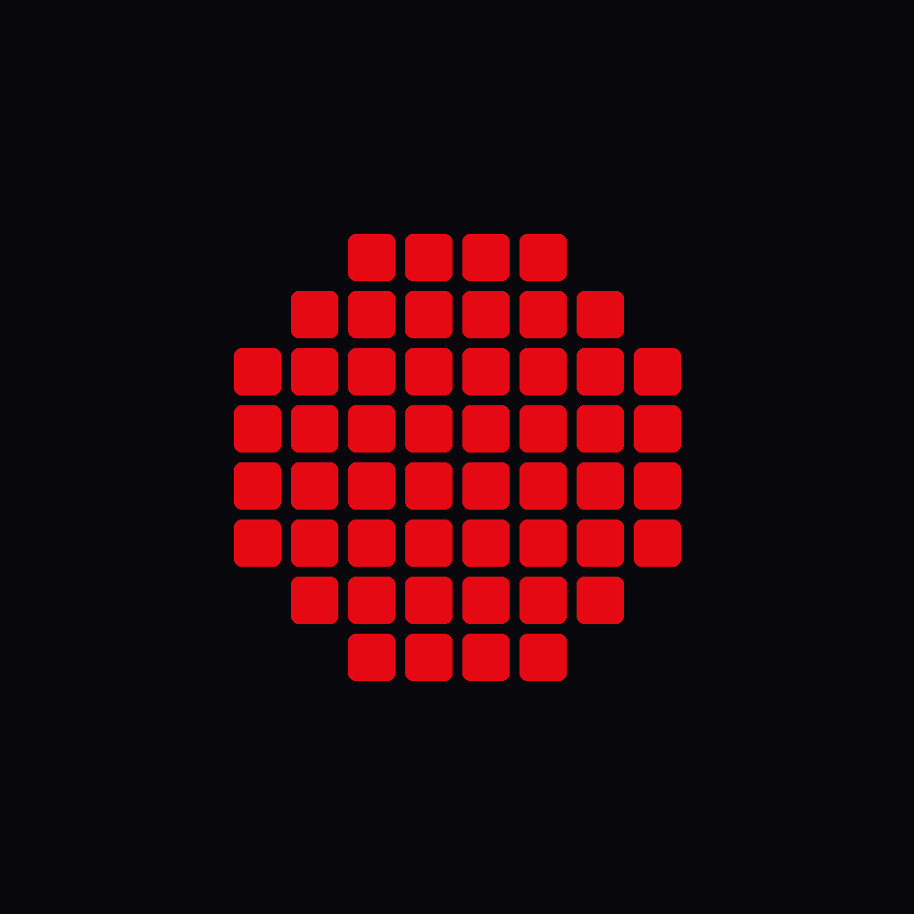
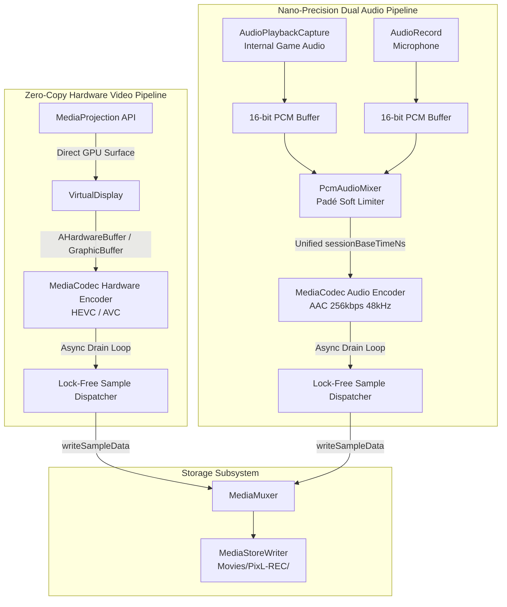

<div align="center">

  

  # REC
  ### Zero-Copy • Hardware-Accelerated • 120+ FPS • Nanosecond Audio Sync
  
  **An ultra-high-performance, zero-bloat Android screen recording engine engineered in Kotlin & Jetpack Compose.**

  <br />

  [](https://github.com/pixlofficial/rec/releases/latest)
  [](https://developer.android.com)
  [](./LICENSE)
  [](https://github.com/pixlofficial/rec/actions)
  [](#-build--release-hardening)
  [](#-privacy-first--zero-bloat)

  <br />
</div>

---

## 📖 Overview

**REC** is a next-generation screen recording application and media engine for Android. Designed from the ground up for mobile gamers, content creators, and power users, REC bypasses the traditional CPU-heavy bottlenecks of standard screen recorders by piping GPU display frames directly into hardware silicon ASIC encoders via **zero-copy hardware input surfaces**.

With REC, you capture pristine **1080p / 1440p / 4K footage up to 120+ FPS** while maintaining strictly below **~3–5% CPU utilization**, keeping gaming framerates high and device temperatures low.

---

## ⚡ Key Highlights & Capabilities

* 🚀 **Zero-Copy Surface Pipeline:** Zero CPU RAM copying. `MediaProjection` $\rightarrow$ `VirtualDisplay` $\rightarrow$ `MediaCodec` Input Surface (`AHardwareBuffer` / `GraphicBuffer`).
* 🏎️ **120+ FPS Hardware Capture:** Unlocked high-refresh rate recording auto-probed against display and VPU hardware limits.
* 🔒 **Lock-Free Hot Path:** Zero thread lock acquisitions on the hot frame loop once muxer starts; thread-safe atomic data counters.
* 🎙️ **Dual-Stream Studio Audio Engine:** Concurrently captures internal game audio (`AudioPlaybackCapture`) and microphone commentary with a custom 16-bit 48 kHz PCM software mixer.
* 🎚️ **Padé [3/3] Soft-Knee Limiter:** High-speed rational polynomial limiter (`x * (27 + x²) / (27 + 9x²)`) preventing digital audio clipping and distortion without native JNI math overhead.
* ⏱️ **Frame-0 Monotonic Synchronization:** Audio PCM and video presentation timestamps (`PTS`) are aligned to a single monotonic baseline (`sessionBaseTimeNs`), completely eliminating startup lip-sync drift.
* 🔄 **Dynamic Canvas & Live Resizing:** Dynamically adapts to device orientation changes mid-recording without stopping or distorting video, with support for **Canvas Orientation Locking** (`AUTO`, `LANDSCAPE`, `PORTRAIT`).
* 🪟 **Cyberpunk Radial Floating HUD:** Magnetized floating glass overlay with 4-node radial action fan, ghost auto-hide standby, and edge-gesture recall.
* 📦 **Instant Media Vault (<15ms):** Asynchronous background thumbnail decoding backed by an in-memory 64-item `LruCache`.
* 🛡️ **100% Offline & Private:** Zero ads, zero tracking SDKs, zero cloud dependencies, and zero accounts. Saves locally to Scoped Storage.
* 🪶 **20 MB Lightweight Binary:** Full R8 ProGuard bytecode optimization and resource shrinking for minimal storage footprint.

---

## 🏗️ Architecture & Pipeline Overview



---

## 📊 Benchmark & Comparison

| Feature / Metric | Standard Screen Recorders | Built-in OEM Recorders | **REC (by PixL)** |
| :--- | :--- | :--- | :--- |
| **CPU Overhead (1080p 60–120 FPS)** | 15% – 35% (causes game lag) | ~6% – 10% | **~3% – 5% (virtually imperceptible)** |
| **Maximum Framerate** | Capped at 60 FPS | Capped by OEM | **Native 120+ FPS Hardware Unlocked** |
| **Hot Path Lock Contention** | Synchronized locks per frame | Closed source | **Lock-Free Atomic Fast-Path** |
| **Startup Memory Churn** | 5–15 MB GC allocations | Undocumented | **Zero Allocations (Buffer Pool)** |
| **Internal Audio + Mic Mixing** | Requires root or paid SDK | Limited/Basic | **Built-in 48kHz Stereo PCM Mixer** |
| **Audio Saturation Protection** | Hard clipping distortion | Basic limiter | **Padé [3/3] Polynomial Soft Limiter** |
| **Startup A/V Sync Drift** | Common on start/pause | Varies by OEM | **Nano-Precision Monotonic Baseline** |
| **Mid-Recording Auto-Rotation** | Distorts, stretches, or stops | Inflexible | **Live Viewport Rescaling + Canvas Lock** |
| **Floating Overlay UI** | Intrusive legacy views | None / Basic pill | **Cyberpunk Radial Fan HUD (Compose)** |
| **Privacy & Telemetry** | Ads, trackers, cloud sync | Manufacturer telemetry | **100% Offline, Zero Ads, Zero Trackers** |
| **Standalone APK Size** | 50 MB – 120 MB | N/A (System ROM) | **~20 MB (R8 Minified)** |

---

## 🎛️ Technical Specifications

| Parameter | Supported Range | Default Configuration |
| :--- | :--- | :--- |
| **Target Framerates** | 30 FPS • 60 FPS • 90 FPS • **120+ FPS** | Probed display native refresh (up to 120 Hz) |
| **Video Codecs** | **HEVC (H.265)** • **AVC (H.264)** • AV1 (probed) | Hardware HEVC with automatic fallback to AVC |
| **Bitrate Tiers** | `8 Mbps` • `16 Mbps` • `28 Mbps` • `50 Mbps` • `80 Mbps` | `16 Mbps` (Standard Balanced) |
| **Bitrate Modes** | Variable Bitrate (VBR) • Constant Bitrate (CBR) • Constant Quality (CQ) | VBR (Hardware MediaCodec) |
| **Macroblock Alignment** | 16-pixel boundary rounding (`((dim + 15) / 16) * 16`) | Native hardware alignment (zero VPU padding) |
| **Audio Routing** | Game Audio Only • Mic Only • Game + Mic • Mute | `Game Audio + Mic` (Stereo 48 kHz, 256 kbps) |
| **Audio Processing** | 16-bit PCM software mixer with Padé [3/3] soft-knee limiting | 48,000 Hz, 2 channels, 10Hz RMS telemetry |
| **Orientation Modes** | `AUTO` (Follow device) • `LANDSCAPE` (Force 16:9) • `PORTRAIT` (Force 9:16) | `AUTO` |
| **Stop Triggers** | Accelerometer Shake (5Hz sampled) • Screen Off / Lock • Game Pill | Shake-to-Stop & Screen-Off Enabled |
| **Platform Target** | **Android 10 (API 29)** up to **Android 16 Ready (API 36)** | Min SDK 29 / Target SDK 35 / Compile SDK 36 |

---

## 📱 Interface Showcase

<div align="center">
  
  &nbsp;&nbsp;
  
  &nbsp;&nbsp;
  
</div>

---

## 🚀 Installation & Downloads

### Standalone Release (GitHub)
Download the latest signed standalone binaries from our **[Releases Page](https://github.com/pixlofficial/rec/releases)**:

* **`REC-v0.2.0.apk`** (or `REC.apk`) — Universal standalone optimized release build (~20 MB).
* **`REC-v0.2.0-debug.apk`** — Debug build with logging and development inspection tools.
* **`REC-v0.2.0.aab`** — Google Play App Bundle with full split-APK optimization.
* **`SHA256SUMS.txt`** — Cryptographic SHA-256 verification checksums for all release binaries.

---

## 🛠️ Building From Source

### Prerequisites:
* **JDK 17 or JDK 21**
* **Android Studio (Ladybug / Meerkat or newer)**
* **Android SDK Build Tools 35.0.0+ / SDK Platform 36**

### Local Build Commands:

```bash
# 1. Clone the repository
git clone https://github.com/pixlofficial/rec.git
cd rec

# 2. Run unit test suite
./gradlew test

# 3. Assemble Standalone Debug APK
./gradlew assembleDebug
# Output: app/build/outputs/apk/debug/REC-v0.2.0-debug.apk

# 4. Assemble Optimized Release APK (R8 Minified + Resource Shrunk)
./gradlew assembleRelease
# Output: app/build/outputs/apk/release/REC-v0.2.0.apk

# 5. Assemble Google Play Store App Bundle (AAB)
./gradlew bundleRelease
# Output: app/build/outputs/bundle/release/app-release.aab
```

---

## 📁 Repository Architecture

```
REC/
├── app/
│   ├── build.gradle.kts         # Build config (R8 minification, compileSdk 36, custom binary naming)
│   ├── proguard-rules.pro       # ProGuard rules for Parcelable models & Compose runtime
│   └── src/main/
│       ├── AndroidManifest.xml  # Foreground services, permissions, QS tiles
│       ├── java/pixl/rec/
│       │   ├── RecApp.kt        # Application initialization & notification channels
│       │   ├── core/
│       │   │   ├── engine/      # Master ScreenRecorderEngine, VideoEncoder, AudioEncoder, CodecProbe
│       │   │   ├── audio/       # AudioCaptureManager & 16-bit PCM software audio mixer
│       │   │   ├── sensor/      # Accelerometer ShakeDetector (~5Hz power-optimized)
│       │   │   ├── storage/     # MediaStoreWriter, StorageCalculator & ConfigPreferences
│       │   │   └── model/       # Parcelable RecordingConfig, RecorderState & DeviceCapabilities
│       │   ├── service/
│       │   │   ├── RecordingService.kt       # MediaProjection Foreground Service
│       │   │   └── FloatingOverlayService.kt # Draggable WindowManager Compose overlay
│       │   └── ui/
│       │       ├── dashboard/   # Live Telemetry Dashboard & Hero Recording Card
│       │       ├── overlay/     # Floating Pill View & Radial Fan Menu
│       │       ├── vault/       # In-App Media Vault with Async LruCache
│       │       ├── settings/    # Recording Configurations Deck
│       │       ├── more/        # App info, open-source licenses & diagnostics
│       │       ├── navigation/  # Bottom navigation bar & floating record shutter
│       │       └── theme/       # Cyberpunk dark theme, neon tokens & typography
│       └── res/                 # Vector drawables, fonts, and strings
│
├── assets/
│   ├── branding/                # High-res logos and launcher icons
│   ├── icons/                   # Pixel-art style vector SVG assets
│   └── screenshots/             # Application showcase captures
│
├── .github/workflows/
│   └── build-apk.yml            # CI/CD: Automated Gradle test, AAB & APK releases
├── version.properties           # Single source of truth for versioning (0.2.0)
├── CHANGELOG.md                 # Keep a Changelog release history
├── AGENTS.md                    # Coding standards & development guidelines
├── CONTRIBUTING.md              # Open-source contribution guidelines
└── LICENSE                      # GNU General Public License v3.0 (GPL-3.0)
```

---

## 🤝 Contributing

We welcome contributions from developers, creators, and audio/video engineers! Please review our **[CONTRIBUTING.md](./CONTRIBUTING.md)** and **[AGENTS.md](./AGENTS.md)** for architecture principles, zero-copy performance rules, and pull request workflows before submitting code.

---

## 📜 License

**REC** is free and open-source software licensed under the **[GNU General Public License v3.0 (GPL-3.0)](./LICENSE)**.

<div align="center">
  <sub>Crafted with precision by <b>PixL</b> • Engineered for Zero-Copy Performance.</sub>
</div>
