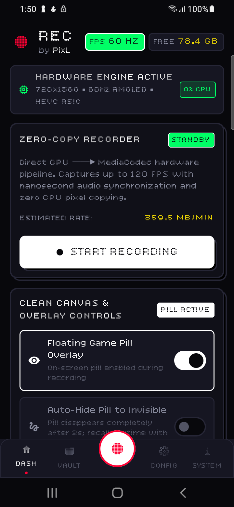
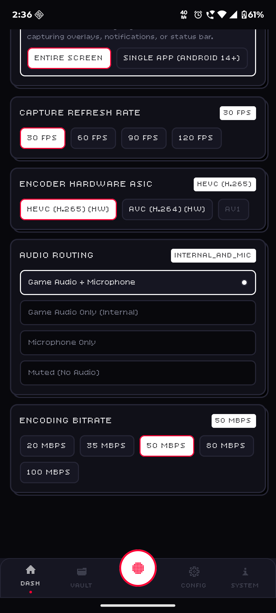

<div align="center">

  

  # REC
  ### Zero-Copy • Hardware-Accelerated • 120+ FPS • Nanosecond Audio Sync
  
  **A high-performance Android screen recording engine engineered in Kotlin & Jetpack Compose.**

  <br />

  [](https://developer.android.com)
  [](./LICENSE)
  [](https://github.com/pixlofficial/rec/actions)
  [](#-zero-copy-architecture)
  [](#-privacy-first--zero-bloat)

  <br />
</div>

---

## ⚡ Core Engineering Pillars

### 1. Zero-Copy Performance Pipeline
* **Direct Hardware Pipe:** `MediaProjection` $\rightarrow$ `VirtualDisplay` $\rightarrow$ `MediaCodec` Input Surface (`AHardwareBuffer` / `GraphicBuffer`).
* **Zero CPU Pixel Copying:** Raw frames never touch user-space CPU memory or `ImageReader`, keeping overhead strictly below **~3–5% CPU** even during active 1080p 120 FPS gaming.
* **Hardware ASIC Encoding:** Auto-calibrated hardware encoders for **HEVC (H.265)** and **AVC (H.264)** with real-time rate envelope protection against Qualcomm and MediaTek hardware block-rate limits.

### 2. Real-Time Dynamic Auto-Rotation
* **Mid-Stream Resizing:** Dynamic `DisplayManager.DisplayListener` detects device orientation changes on-the-fly and resizes the `VirtualDisplay` in real-time.
* **No Letterboxing & No Interruptions:** Smoothly transition between portrait apps and landscape games without stopping or corrupting the recording stream.

### 3. Nano-Precision Dual Audio Synchronization
* **Internal Audio Loopback:** Native Android 10+ internal system sound capture via `AudioPlaybackCaptureConfiguration`.
* **Microphone Mixing:** Concurrent 48 kHz 16-bit PCM voice commentary capture with saturation soft-clipping protection.
* **Nanosecond Alignment:** Every audio and video frame is stamped with `System.nanoTime()` for monotonic presentation timestamp (`PTS`) alignment, eliminating audio drift and playback stutter.

### 4. Clean Canvas & Invisible Ghost Pill
* **Draggable Overlay:** Magnetic floating game pill built with pure Jetpack Compose.
* **Ghost Auto-Hide Mode:** Pill automatically vanishes after 2 seconds of inactivity.
* **Instant Gesture Recall:** Recall controls anytime via screen edge swipes, double taps, or notification action.
* **Decoupled Permissions:** Screen capture operates smoothly even on Android 13–16 devices with sideload Restricted Settings.

### 5. Privacy First • Zero Bloat
* **100% Offline:** No mandatory user accounts, no telemetry frameworks, no cloud sync requirements, and zero advertising SDKs.
* **Scoped Storage:** Clean, sandboxed media management via native `MediaStore.Video.Media`.

---

## 📱 Screenshots Showcase

<div align="center">
  
  &nbsp;&nbsp;
  
  &nbsp;&nbsp;
  
</div>

---

## 🎛️ Technical Specifications

| Parameter | Supported Range | Default Configuration |
| :--- | :--- | :--- |
| **Framerate** | 30 FPS • 60 FPS • 90 FPS • **120+ FPS** | Probed display native refresh (up to 120 Hz) |
| **Video Codecs** | HEVC (H.265) • AVC (H.264) | Hardware HEVC with auto-fallback to AVC |
| **Bitrate Tiers** | `8 Mbps` • `16 Mbps` • `28 Mbps` • `50 Mbps` • `80 Mbps` | `16 Mbps` (Standard Balanced) |
| **Audio Routing** | Internal System Sound • Mic • Internal + Mic • Mute | `Internal Audio + Mic` (Stereo 48 kHz, 256 kbps) |
| **Stop Triggers** | Accelerometer Shake • Screen Off / Lock • Game Pill | Shake-to-Stop & Screen-Off Enabled |
| **Target Platform** | Android 10 (API 29) to Android 16 (API 36) | Min SDK 29 / Target SDK 35 / Compile SDK 36 |

---

## 🚀 Installation & Download

### Standalone Release (GitHub)
Download the latest signed standalone APK from our **[Releases Page](https://github.com/pixlofficial/rec/releases)**:
* `PixL-REC-v0.1.0.apk` — Universal Android release build.

### Google Play Store
* *(Coming Soon)* — Production Android App Bundle (`.aab`) builds are automatically generated and verified via CI/CD.

---

## 🛠️ Building From Source

### Prerequisites:
* **JDK 17 or 21**
* **Android Studio (Ladybug / Meerkat or newer)**
* **Android SDK Build Tools 35.0.0+**

### Local Build Commands:
```bash
# 1. Clone repository
git clone https://github.com/pixlofficial/rec.git
cd rec

# 2. Compile Debug APK & Run Unit Tests
./gradlew assembleDebug test

# 3. Assemble Signed Release APK
./gradlew assembleRelease

# 4. Assemble Google Play Store App Bundle (AAB)
./gradlew bundleRelease
```

---

## 📁 Repository Architecture

```
REC/
├── app/
│   └── src/main/java/dev/pixl/recorder/
│       ├── core/
│       │   ├── engine/          # MediaCodec Surface, CodecProbe & Master Orchestrator
│       │   ├── audio/           # AudioPlaybackCapture & 16-bit PCM Audio Mixer
│       │   ├── sensor/          # Accelerometer Shake-to-Stop detector
│       │   ├── storage/         # Scoped Storage & File Bitrate Estimator
│       │   └── model/           # StateFlow models & configurations
│       ├── service/             # MediaProjection Foreground & Floating Overlay Services
│       └── ui/                  # Clean Dark Jetpack Compose Screens & Components
│
├── assets/
│   ├── branding/                # High-res logos and vectors
│   ├── icons/                   # Custom navigation icon assets
│   └── screenshots/             # Interface showcase captures
│
├── .github/workflows/           # CI/CD: Automated Google Play AAB & APK releases
├── version.properties           # Single source of truth for versioning (0.1.0)
├── CHANGELOG.md                 # Keep a Changelog release history
├── CONTRIBUTING.md              # Open-source contribution guidelines
└── LICENSE                      # GNU General Public License v3.0 (GPL-3.0)
```

---

## 🤝 Contributing

We welcome contributions from developers and creators! Please review our **[CONTRIBUTING.md](./CONTRIBUTING.md)** and **[AGENTS.md](./AGENTS.md)** for architecture guidelines, zero-copy rules, and PR workflows before submitting code.

---

## 📜 License

**REC** is free and open-source software licensed under the **[GNU General Public License v3.0 (GPL-3.0)](./LICENSE)**.

<div align="center">
  <sub>Crafted with precision by <b>PixL</b> • Engineered for Performance.</sub>
</div>
